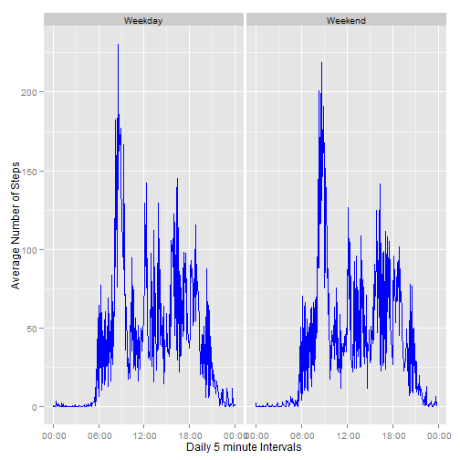

## Loading and preprocessing the data

```r
library(lubridate)

if(!file.exists('activity.csv'))
    unzip('activity.zip')
myData <- read.csv("activity.csv")

#format the date
myData$date <- as.Date(myData$date, format="%Y-%m-%d")

#Create date/time column*-+

myData$date.time <- as.POSIXct(
    paste(myData$date, formatC(myData$interval/100, 2, format = "f")), 
    format = "%Y-%m-%d %H.%M", 
    tz = "GMT")

#Format the time
myData$time <- format(myData$date.time, format = "%H:%M:%S")
myData$time <- as.POSIXct(myData$time, format = "%H:%M:%S")

myData$interval <- as.factor(myData$interval)

days <- as.factor(myData$date)

intervals <- as.numeric(levels(myData$interval))
```

## What is mean total number of steps taken per day?
Calculate the mean and median number of steps taken per day

```r
numSteps <- tapply(myData$steps, myData$date, sum, na.rm=TRUE)

mean(numSteps)
```

```
## [1] 9354.23
```

```r
median(numSteps)
```

```
## [1] 10395
```
Let's show a histogram of the total number of steps taken each day

```r
library(ggplot2)

qplot(
    numSteps, 
    xlab='Total Steps Each Day', 
    ylab='Frequency')
```

 

## What is the average daily activity pattern?

Let's make a time series plot of the 5 minute intervals (x axis) and the average number of steps taken, averaged across all days (y axis)


```r
#calculate the mean steps for each interval
avgSteps <- tapply(myData$steps, myData$time, mean, na.rm=TRUE)

#create date frame with mean steps
activityPattern <- data.frame(time=as.POSIXct(names(avgSteps)),
                            avgSteps=avgSteps)

myPlot <- ggplot(
        activityPattern,
        aes(intervals, avgSteps),
    )
myPlot + 
    geom_line(colour="red") + 
    ggtitle("Time Series Plot of the 5m Interval and the avg No. Steps Taken") +
    xlab("5 Min Intervals") +
    ylab("Avg Num Steps Taken")
```

 

Which 5-minute interval, on average across all the days in the dataset, contains the maximum number of steps?


```r
maxSteps <- which.max(activityPattern$avgSteps)

format(
    activityPattern[maxSteps, 'time'], 
    format = "%H:%M"
    )
```

```
## [1] "08:35"
```


## Imputing missing values

Find missing values:

```r
#find rows of missing values
isNAs <- is.na(myData)
```

There are 2304 missing values in the dataset (total number of rows with "NAs")

Fill in missing values; we'll use the 5 minute interval mean to keep the data simliar

```r
#create a copy to preserve original
cleanData <- myData

cleanData$steps[is.na(cleanData$steps)] <- 
    tapply(cleanData$steps, cleanData$interval, mean, na.rm = TRUE)

#compare the two
summary(myData)
```

```
##      steps             date               interval    
##  Min.   :  0.00   Min.   :2012-10-01   0      :   61  
##  1st Qu.:  0.00   1st Qu.:2012-10-16   5      :   61  
##  Median :  0.00   Median :2012-10-31   10     :   61  
##  Mean   : 37.38   Mean   :2012-10-31   15     :   61  
##  3rd Qu.: 12.00   3rd Qu.:2012-11-15   20     :   61  
##  Max.   :806.00   Max.   :2012-11-30   25     :   61  
##  NA's   :2304                          (Other):17202  
##    date.time                        time                    
##  Min.   :2012-10-01 00:00:00   Min.   :2014-12-14 00:00:00  
##  1st Qu.:2012-10-16 05:58:45   1st Qu.:2014-12-14 05:58:45  
##  Median :2012-10-31 11:57:30   Median :2014-12-14 11:57:30  
##  Mean   :2012-10-31 11:57:30   Mean   :2014-12-14 11:57:30  
##  3rd Qu.:2012-11-15 17:56:15   3rd Qu.:2014-12-14 17:56:15  
##  Max.   :2012-11-30 23:55:00   Max.   :2014-12-14 23:55:00  
## 
```

```r
summary(cleanData)
```

```
##      steps             date               interval    
##  Min.   :  0.00   Min.   :2012-10-01   0      :   61  
##  1st Qu.:  0.00   1st Qu.:2012-10-16   5      :   61  
##  Median :  0.00   Median :2012-10-31   10     :   61  
##  Mean   : 37.38   Mean   :2012-10-31   15     :   61  
##  3rd Qu.: 27.00   3rd Qu.:2012-11-15   20     :   61  
##  Max.   :806.00   Max.   :2012-11-30   25     :   61  
##                                        (Other):17202  
##    date.time                        time                    
##  Min.   :2012-10-01 00:00:00   Min.   :2014-12-14 00:00:00  
##  1st Qu.:2012-10-16 05:58:45   1st Qu.:2014-12-14 05:58:45  
##  Median :2012-10-31 11:57:30   Median :2014-12-14 11:57:30  
##  Mean   :2012-10-31 11:57:30   Mean   :2014-12-14 11:57:30  
##  3rd Qu.:2012-11-15 17:56:15   3rd Qu.:2014-12-14 17:56:15  
##  Max.   :2012-11-30 23:55:00   Max.   :2014-12-14 23:55:00  
## 
```

Histogram of the new Data Set:

```r
cleanNumSteps <- tapply(cleanData$steps, cleanData$date, sum)

qplot(
    cleanNumSteps, 
    xlab='Total Steps Each Day', 
    ylab='Frequency')
```

 


## Are there differences in activity patterns between weekdays and weekends?
Create a new factor variable in the dataset with two levels - "weekday" and "weekend" indicating whether a given date is a weekday or weekend day.

```r
#add Day to our cleanData
cleanData$Day <- weekdays(as.Date(as.character(cleanData$date)))

#add weekend value to our cleanData
cleanData$DayType <- as.factor(c("Weekend","Weekday"))

weekendDays <- cleanData$Day == "Saturday" | cleanData$Day == "Sunday"

cleanData$DayType[weekendDays] = "Weekend"
cleanData$DayType[!weekendDays] = "Weekday"


cleanAvgSteps <- tapply(cleanData$steps, 
                        interaction(cleanData$time, cleanData$DayType),
                        mean)

cleanPattern <- data.frame(time=as.POSIXct(names(cleanAvgSteps)), 
                           cleanAvgSteps = cleanAvgSteps, 
                           DayType = as.factor(c("Weekend","Weekday")))
```

Make a panel plot containing a time series plot (i.e. type = "l") of the 5-minute interval (x-axis) and the average number of steps taken, averaged across all weekday days or weekend days (y-axis).


```r
library(scales)

ggplot(cleanPattern, aes(time, cleanAvgSteps)) +
    geom_line(color="blue") +
    xlab("Daily 5 minute Intervals") +
    ylab("Average Number of Steps") +    
    scale_x_datetime(labels = date_format(format =' %H:%M')) +
    facet_grid(. ~ DayType)
```

 
